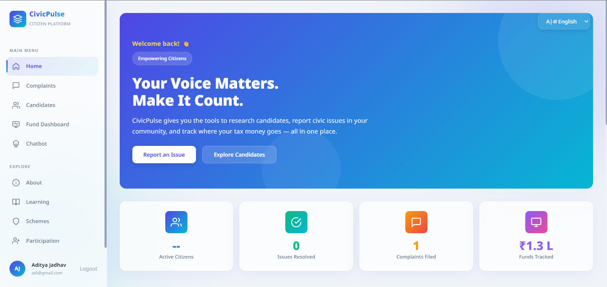
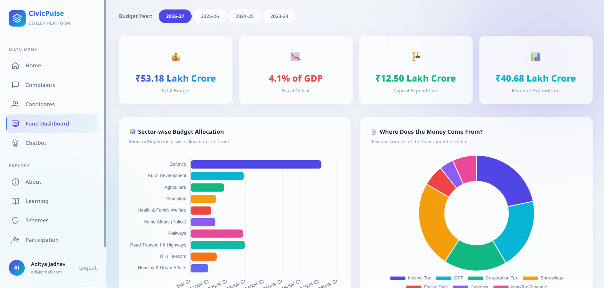
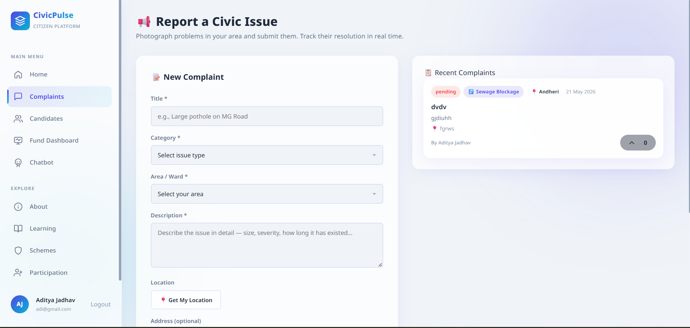

# 🏛️ CivicPulse  


# 📌 Description

CivicPulse is a modern civic engagement platform that empowers citizens to report local civic issues, monitor complaint resolution progress, and track government transparency through real-time dashboards and community participation tools.

Built with a clean glassmorphism-inspired interface, CivicPulse combines public accountability, digital governance, and community-driven problem solving into one scalable platform.

---

# 🚀 Live Demo

### Frontend:

https://whistech.github.io/Civic_Pulse/


🧪 Explore issue reporting, public dashboards, multilingual support, and authority management systems directly in the browser.

---

# 💻 Local Development

Follow these steps to run CivicPulse locally.

---

# ⚙️ Setup Instructions

## 1️⃣ Clone the Repository

```bash
git clone https://github.com/<YOUR_GITHUB_USERNAME>/CivicPulse.git

cd CivicPulse
```

---

# 🔥 Firebase Configuration

## 2️⃣ Create Firebase Project

1. Open Firebase Console
2. Create a new Firebase Web App
3. Enable:
   - Firestore Database
   - Firebase Authentication
   - Firebase Hosting (Optional)

---

## 3️⃣ Configure Firebase SDK

Open:

```bash
js/firebase-config.js
```

Paste your Firebase credentials:

```javascript
const firebaseConfig = {
  apiKey: "YOUR_API_KEY",
  authDomain: "YOUR_DOMAIN",
  projectId: "YOUR_PROJECT_ID",
  storageBucket: "YOUR_BUCKET",
  messagingSenderId: "YOUR_SENDER_ID",
  appId: "YOUR_APP_ID"
};
```

---

# 🔐 Firestore Security Rules

Go to:

```bash
Firestore Database → Rules
```

Deploy the rules from:

```bash
firestore.rules
```

This secures:
- Citizen access
- Authority-only operations
- Complaint management permissions
- Protected database writes

---

# ▶️ Run the Project

Using Node:

```bash
npx serve .
```

Or using Python:

```bash
python -m http.server 8000
```

Open:

```bash
http://localhost:8000
```

---

# ✨ Features

## 🌍 Real-Time Issue Reporting
- Report local civic problems instantly
- Upload images and descriptions
- Track issue status in real-time

## 🗳️ Community Voting & Prioritization
- Citizens can support important complaints
- Dynamic ranking system for issue prioritization
- Community-driven visibility

## 📈 Budget Transparency Dashboard
- Track public budget allocations
- Interactive financial visualizations
- Multi-year civic analytics

## 🔐 Secure Authentication System
- Firebase Authentication
- Role-based access control
- Protected authority dashboards

## 🌐 Multi-Language Support
Built-in support for:
- English
- Hindi
- Marathi

## 🤖 AI Civic Utilities
- AI-powered chatbot utilities
- Planned smart complaint categorization
- Intelligent issue analysis system

---

# 🛠️ Tech Stack

| Category | Technology |
|---|---|
| Frontend | HTML5, CSS3, Vanilla JavaScript |
| UI Design | Glassmorphism UI |
| Database | Firebase Firestore |
| Authentication | Firebase Auth |
| Charts | Chart.js |
| Backend Utilities | Python FastAPI |
| Hosting | Firebase Hosting |

---

# 📸 Screenshots

## 🏠 Home Dashboard



---

## 📊 Budget Dashboard



---

## 🗺️ Civic Issue Reporting



---

# 🚦 Quick Start

```bash
# Clone project
git clone https://github.com/<YOUR_USERNAME>/CivicPulse.git

# Open project
cd CivicPulse

# Run local server
npx serve .
```

---

# 📂 Folder Structure

```bash
CivicPulse/
│
├── css/
├── js/
│   ├── firebase-config.js
│   ├── app.js
│   ├── dashboard.js
│   └── auth.js
│
├── assets/
├── firestore.rules
├── backend/
│   └── FastAPI utilities
│
├── index.html
└── README.md
```

---

# 🔗 Core Modules

## 👤 Authentication
- Citizen login/signup
- Authority authentication
- Secure session handling

---

## 📍 Complaint Management
- Submit complaints
- Track resolution
- Manage issue statuses

---

## 📊 Transparency Dashboard
- Budget tracking
- Civic analytics
- Resolution metrics

---

## 🏛️ Authority Dashboard
- Complaint moderation
- Resolution management
- Civic monitoring tools

---

# 🎭 User Roles

## 👤 Citizen
- Submit local complaints
- Vote on community issues
- Track issue resolution
- View civic budgets

---

## 🏛️ Mayor / Authority
- Access authority dashboard
- Manage civic complaints
- Mark issues as resolved
- Monitor public reports

---

# 🗺️ Future Roadmap

## ✅ Planned Features

- AI-Based Complaint Categorization
- Smart Duplicate Issue Detection
- Firebase Push Notifications
- GIS Heatmaps
- Progressive Web App (PWA)
- Native Mobile Application
- Advanced Civic Analytics
- AI-Powered Recommendation System

---

# 🤝 Contributing

```bash
# Fork repository
# Create feature branch
git checkout -b feature-branch

# Commit changes
git commit -m "feat: add new feature"

# Push changes
git push origin feature-branch
```

Pull Requests, improvements, and suggestions are welcome.

---

# 📜 License

This project is licensed under the MIT License.

---

# 💡 Vision

CivicPulse aims to create a transparent, accountable, and technology-driven civic ecosystem where every citizen can actively participate in improving their community.

---
